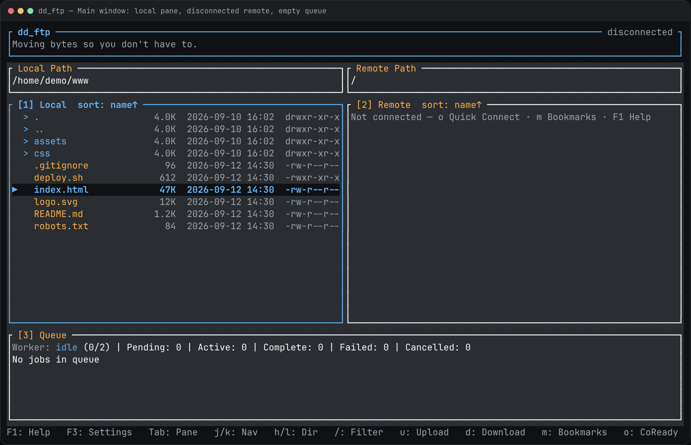

# dd_ftp

Terminal FTP/SFTP/FTPS client built with Rust + ratatui.



**Illustrated tutorial (install, first run, keys, screenshots):** [ldnddev.github.io/dd_ftp](https://ldnddev.github.io/dd_ftp/)

## Install

Downloads the prebuilt package for your OS and CPU (Linux, macOS, or Windows) and installs `dd_ftp` to `~/.local/bin`. If no package exists for your machine, the script builds from source.

```bash
curl -fsSL https://raw.githubusercontent.com/ldnddev/dd_ftp/master/install.sh | bash
```

Pin a release: `bash -s -- --version v1.6.1`. Uninstall: `bash -s -- --uninstall`. From a checkout: `./install.sh`. Full options, PATH notes, and env vars are in the [tutorial](https://ldnddev.github.io/dd_ftp/#install).

## Run

```bash
dd_ftp
cargo run -p dd_ftp_cli
```

`F1` is help. `Ctrl+q` quits.

## What you get

- SFTP + FTP + FTPS connect/list/upload/download
- Dual-pane browser (local/remote) + queue panel
- Parallel transfer workers + cancellation/retry/overwrite
- Quick Connect + Bookmarks + keyring-backed credential storage
- Theme system (`dd_ftp_theme.yml`) + F2 live theme editor
- Directory compare, filters, multi-select, chmod, remote edit

Visual contract: [`LDNDDEV_TUI_VISUAL_STANDARD.md`](LDNDDEV_TUI_VISUAL_STANDARD.md).

## License

MIT
